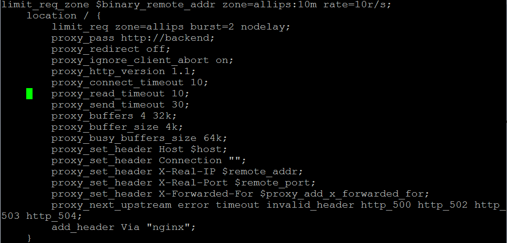

# SwooleYaf-佳优框架

俗语云:人无我有,人有我优.佳优框架(SwooleYaf)立志于创造一个优秀的框架,由佳而优,以美好的梦想为起点,为辉煌的未来加油

SwooleYaf是PHP语言的高性能分布式微服务框架,专注于restful api接口开发,也可适用于前后端分离架构设计下服务端渲染模式的前端项目开发
- 底层基于高性能通信框架swoole,业务框架以高性能MVC框架yaf为骨架
- 模块之间消息通信以msgpack为基础,自定义通信协议,降低通信数据大小,提升通信安全性
- 内置接口签名,异步任务,定时任务等实用功能,生产环境可实现api接口处理平均耗时在20毫秒左右
- 基于该框架搭建项目请参考下面的<a href="#1">搭建项目</a>章节

# 环境
## 搭建脚本
请移步至项目 https://github.com/a07061625/swooleyaf_install.git

## 必要扩展
- swoole4.2.8+
- msgpack
- yaf3.0.4+
- yaconf1.0+
- yac2.0+
- redis3.0+
- Seaslog1.6+
- bcmath
- PDO
- pcre
- pcntl
- opcache

## 可选扩展
- imgick3.4+
- mongodb1.2+
- xdebug2.5+
- xhprof1.0+

## 其他
- gcc4.8+ //php7编译用gcc4.8+会开启Global Register for opline and execute_data支持, 这个会带来5%左右的性能提升

# <a name="1">搭建项目</a>
## 初始设置
    //建议在php.ini所在目录创建php-cli.ini和php-fpm-fcgi.ini两个配置文件
    //前一个为cli模式下的环境配置,后一个为fpm模式下的环境配置
    //好处在于可以为cli模式和fpm模式设置独立的配置
    vim php-cli.ini
        yaconf.directory="yaconf配置目录,不以/结尾"
    mv yaconf/* yaconf配置目录/

## 初始设置建议
**强烈建议将libs_frame目录移出到一个单独的目录,好处在于可以多个项目共用同一个公共库,只要公共库升级,那所有依赖公共库的项目框架自动升级**

    mkdir 公共库目录
    mv libs_frame/ 公共库目录/
    //建议最好将公共库目录设置为一个git项目,方便后续公共库文件更新

## 项目设置
- 在yaconf配置目录下的所有ini文件中,添加对应的项目配置块
- 配置块的标识由helper_load.php文件中的SY_ENV常量拼接上SY_PROJECT常量组成
- SY_ENV的取值有dev,product两个,分别代表测试环境和正式环境
- SY_PROJECT是由数字和小写字母组成的长度为3的字符串,不同项目必须不同
- 修改yaconf配置目录/project.ini中对应配置块下的dir.libs.frame配置为"公共库目录/libs_frame/"
- 以上步骤配置完成以后即创建了一个新的项目

## PhpStorm开发配置
**打开控制面板并如下图设置即可**

# 框架介绍
## 使用介绍
- 操作系统只支持linux,不支持windows,因为pcntl扩展,nohup,inotify只有linux才可用
- nginx建议使用版本大于1.9,因为1.9的nginx增加了stream模块,支持tcp反向代理和负载均衡
- favicon.ico请求不在框架内部做处理,建议配置nginx静态文件访问来实现获取该文件
- 建议单独设置一个文件服务模块用于处理文件上传,图片裁剪等功能
- 多服务器部署,必须确保服务端口对外开放,以避免服务模块跨服务器请求调用因端口未开放出现错误
- 框架内部模块之间请求调用全都不用cookie和session
- task任务投递不要投递到taskId=0的进程,该进程用于定时更新模块配置信息
- 对外部只开放api模块,需要获取其他模块的数据,通过发送rpc请求到其他模块获取数据
- api模块返回数据根据业务需求,既可以用控制器的SyResult对象,也可以直接在响应请求中直接设置数据
- api模块负责接受外部请求,返回响应数据,包括设置响应头,cookie等
- 非api模块返回数据统一用控制器的SyResult对象
- 非api模块不能设置响应头,cookie等信息,如需设置这些信息,将这些信息作为响应数据放到SyResult中,返回给api组装来间接设置响应头,cookie等
- 非api模块发送请求只有POST方式,不支持其他方式
- 图片上传请参考api模块Image控制器的uploadImageAction方法
- 微信,支付宝支付与回调处理请参考sy_order模块下的OrderDao文件
- 所有数据库表必须有且只能有单主键,不允许联合主键
- 拉取项目需要安装git和git-lfs,有部分文件是git-lfs上传

## 目录介绍
- libs_frame: 框架公共类目录
- libs_project: 项目公共类目录
- pidfile: 项目进程pid文件存放目录
- static: 静态文件目录
- yaconf: 框架配置文件目录,该目录内的配置文件为样例,使用时需要将配置文件移动到php.ini配置文件中yaconf.directory配置对应的目录下
- 其他目录: 项目模块目录,每一个目录对应一个项目模块

## 命令
**必须将helper_sytask.php文件加入到linux系统cron执行任务中**

### 启动服务
    /usr/local/php7/bin/php helper_service_manager.php -s start-all
### 关闭服务
    /usr/local/php7/bin/php helper_service_manager.php -s stop-all
### 重启服务
    /usr/local/php7/bin/php helper_service_manager.php -s restart-all
### 清理僵尸进程
    /usr/local/php7/bin/php helper_service_manager.php -s kz-all

## 预定义常量
- SY_ROOT //框架根目录
- SY_PROJECT_LIBS_ROOT //项目公共类根目录
- SY_FRAME_LIBS_ROOT //框架公共类根目录
- SY_ENV //框架环境 dev:测试环境 product:生产环境
- SY_PROJECT //框架项目名称
- SY_LOG_PATH //框架日志目录
- SY_SERVER_IP //服务器IP
- SY_VERSION //框架版本号
- SY_MODULE //框架模块名称
- SY_SERVER_TYPE //框架服务端类型 api: api入口 rpc:api模块 frontgate: 前端入口
- SY_REQUEST_MAX_HANDLING //服务同时处理的最大请求数量
- SY_DATABASE //框架数据库重连标识 true: 检测重连 false:不检测重连

## 服务管理
### 获取框架概览信息
    请求地址: http://api.xxx.com/0000

### 获取php信息
    请求地址: http://api.xxx.com/0001

## 性能压测
系统配置:  
 
nginx配置:  
 
压测结果:  
 

## etcd
### 启动服务
    // ip:当前服务器内网或外网ip port:服务监听端口,默认为2379
    nohup etcd --listen-client-urls http://ip:port --advertise-client-urls http://ip:port >/dev/null &

## Mongodb文档
    https://docs.mongodb.com/php-library/

## XDebug代码分析
- 默认关闭了自动堆栈追踪和自动性能分析
- 开启堆栈追踪,如果是GET请求,必须在url上附带XDEBUG_TRACE参数,如果是POST请求,必须在请求体上附带XDEBUG_TRACE参数
- 开启性能分析,如果是GET请求,必须在url上附带XDEBUG_PROFILE参数,如果是POST请求,必须在请求体上附带XDEBUG_PROFILE参数
### 参考链接
    http://blog.csdn.net/why_2012_gogo/article/details/51170609

### 可视化工具
- KCacheGrind(Linux)
- QCacheGrind(Windows)

## XHPROF性能分析
### 使用样例
参考demo_xhprof.php文件

## 代码解耦
善用观察者模式来实现业务代码解耦,具体可参考邮件发送模块

## 接口签名
请求地址带上签名参数,统一只在api模块做签名校验,签名参数如下:
- _sign: 签名值,由数字,字母组成的48位字符串

## 定时任务
- 详情参见分支task

## 数据库连接池
- https://github.com/swoole/php-cp //连接池扩展
- https://github.com/swoole/swoole-src/blob/master/examples/mysql_proxy_server.php //swoole版

## 图片处理
- https://github.com/kosinix/grafika //参考地址
